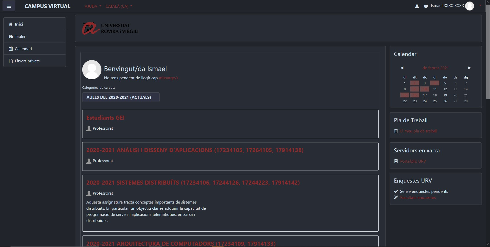

# MoodleURVNightCSS
CSS para aplicar el modo noche al moodle de la URV (Universitat Rovira i Virgili). 
Puede que funcione con otras universidades que utilicen Moodle

### Instalacion con Stylus
  * 
